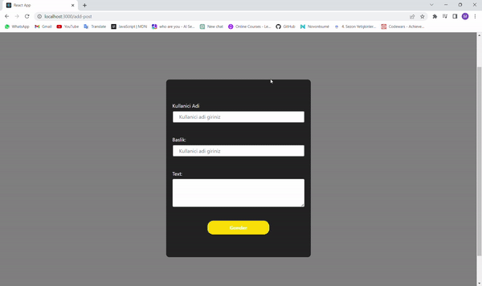

# FORUM PROJECT

This project is a forum built using the MVC technology. Users can post messages to each other, and the application includes a modal that displays how many and which posts each user has sent.

## Technologies Used

<ul>
 <li>MVC Architecture</li>
 <li>Axios for making API calls</li>
 <li>JSON Server for mock API data</li>
 <li>SASS for styling</li>
</ul>

## Getting Started

To get started, clone the repository and run the following command to start the application:

###  `nmp run server`

then,

### `npm start`

The application should then be available at `http://localhost:3000`.

### `npm test`

Launches the test runner in the interactive watch mode.\
See the section about [running tests](https://facebook.github.io/create-react-app/docs/running-tests) for more information.

## Usage

Once the application is running, users can create new posts to send to other users. The modal in the application displays how many posts each user has sent, and clicking on a user's name will display the posts they've sent.

## Contributing

If you'd like to contribute to the project, please fork the repository and submit a pull request.

## ScreenGif

